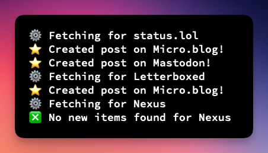

# Echo - RSS Cross Poster



## What is it?

Echo is a node script to post new items from an RSS feed to various services including Micro.blog and Mastodon.

### Why "Echo"?

It does RSS feeds, so Feeder. Feeder are a band with an album called Echo Park. Echo is a good name because the album link AND the meaning of the word echo. So there.

## Requirements

- Node 19 (it might work with earlier versions but that's what I used)
- A server/computer/potato to run it on

## Installation

1. Clone this repository
2. Run `npm install` to install the node module
3. Run `cp config.example.js config.js` to create a new config file
4. Setup your RSS feeds and services (see [configuration](#configuration) for options)
5. Run `node index.js init` to setup - this will store the latest ID so only new posts going forward will be posted. If you want to post _some_ items from a feed, add the ID of the latest item you don't want to post in `data/nameofsite.txt`.
6. Setup a cron to run `node index.js` regularly

🚨 **Warning**: If you don't run `node index.js init` first, the script will post **all** the posts in the RSS feeds. You _probably_ don't want this.

You can also run `node index.js dry`. This will log which posts will be created, but _will not_ post anything.

Echo keeps track of the last item posted so on subsequent runs it will only post new posts.

You can also run Echo with GitHub actions. [See Lewis' blog post for more info](https://lewisdale.dev/post/using-gitea-github-actions-for-triggering-echo/)

## Configuration

There are two parts to configure: `sites` and `services`. `sites` is the RSS feeds you want to cross-post and `services` is the services you want to cross-post to.

Go to [the Echo website](https://echo.rknight.me) to use the config generator and paste the generated config into `config.js` or see below for setting it up manually.

### Sites

`config.sites` is an array of RSS feeds you wish to cross-post. A site has five attribute:

- `name` (required): this can be anything (this is used in a filename so probably don't use special characters).
- `feed` (required): the feed URL you want to post to Micro.blog (e.g. <https://mycoolsite.com/feed>).
- `categories` (optional - only for Micro.blog): An array of categories to assign to you posts for the site (e.g. `["Cat One", "Cat Two"]`).
- `services`: The services you want to cross-post to. See [services](#services).
- `transform`: this is an object with two functions (see below for preset transforms):
  - `getId`: This tells Echo which attribute to use for the ID of each feed item. Most feeds use `id` or `guid` but if it's something different you can set that here.
  - `format`: This is how you format the title, body, and date of the post. This returns an object with content, date, and an optional title.
  - `filter` (optional): Use this if you need to filter out specific items in a feed. For example, Letterboxd includes items for lists being updated which I don't want to be posted.

#### Example Site Configuration

```js
{
    name: "example.com",
    feed: "http://example.com/feed",
    categories: ["my category"],
    services: [SERVICES.MICROBLOG, SERVICES.WEBHOOK]
    transform: {
        getId: (data) => {
            return data.id
        },
        format: (data) => {
            return {
                content: data.content,
                date: data.isoDate,
                title: data.title, // optional
            }
        },
        filter: (items) => {
            return items.filter(item => {
                return !item.link.includes('/list/')
            })
        }
    }
}
```

### Preset Transforms

Echo has a few presets you can use instead of having to write the `getId` and `format` functions for every site. These can be seen in [`presets.js`](lib/presets.js). For example, to use the Letterboxd or status.lol preset you can do the following:

```js
{
    name: "letterboxd.com",
    feed: "http://letterboxd.com/exampleuser/rss",
    categories: ["movies"],
    transform: presets.letterboxd,
},
{
    name: "status.lol",
    feed: "http://exampleuser.status.lol/feed",
    categories: ["status"],
    transform: presets.statuslol,
}
```

You can define the body of your post in `format` to make your posts look exactly how you want. For ease, Echo includes `helpers.js` with some helper libraries.

- To convert HTML to markdown, use `helpers.toMarkdown(text)`
- To use [Cheerio](https://cheerio.js.org/) use `helpers.cheerioLoad(text)`
- To generate a UUID use `helpers.generateUuid()`
- Get the length of the post based on how Mastodon calculates this (links are always 23 characters, for example) `helpers.getMastodonLength(string)`
- Get all links as an array `helpers.getLinks(string)`
- Encode and decode HTML entities with `helpers.decode(string)` and `helpers.encode(string)`

```js
format: (data) => {
    const formatted = presets.default.format(data)

    // get the first link with Cheerio
    // and append it to the content
    const $ = helpers.cheerioLoad(formatted.content)
    const firstLink = $('a:first').attr('href')
    formatted.content += ` ${firstLink}`

    // format to markdown
    formatted.content = helpers.toMarkdown(formatted.content)
    return formatted
}
```

### Services

Each service requires a different set of values depending on how the API works.

#### Micro.blog

|Key|Value|Notes|
|---|---|---|
|`siteUrl`|The Micro.blog site you're posting to|e.g. `https://coolsite.micro.blog`|
|`apiKey`|A Micro.blog API key|Get an API key from [https://micro.blog/account/apps](https://micro.blog/account/apps)|

#### Mastodon

|Key|Value|Notes|
|---|---|---|
|`instance`|Your Mastodon instance|e.g. `https://social.lol`|
|`accessToken`|Go to `Preferences > Development > New Application` on your Mastodon instance and grab the access token|
|`visibility` (optional, default `public`)|`public` `unlisted` `private` `direct`|
|`sensitive` (optional, default `false`)|`false` `true`|

#### Webhooks

The webhook service will send a `POST` request with the result of `transform.format` (as set in your site config) to a given url.

|Key|Value|Notes|
|---|---|---|
|`url`|The URL to post to|

#### Omnivore

The Omnivore service will save a URL to your Omnivore account.

|Key|Value|Notes|
|---|---|---|
|`apiKey`|Your Omnivore API key|


#### GitHub

Create a new file on a GitHub repository.

| Key      | Value                 | Notes |
| -------- | --------------------- | ----- |
| `token` | Your GitHub token |
| `repo` | The repository to commit to | e.g. `rknightuk/echo`
| `branch` | The branch to commit to |
| `committer` | An object with `name` and `email` values | e.g. `{ name: 'Robb', email: 'robb@example.com }`

For posting to Github your `format` function must return `content` and `filePath` where `filePath` is the path to where the file will be in the Github repository, for example `src/posts/movies/2024-02-09.md`. It can optionally return a `commit` message, which will fallback to `New post` if none is set. Example `format` function for GitHub:

```js
format: (data) => {
    return {
        content: data.title,
        date: new Date(data.isoDate).toISOString(),
        filePath: `src/posts/movies/${new Date().getFullYear()}/${new Date().toISOString().split('T').md`,
        commit: `Add ${data.title}`,
    }
}
```

#### LinkAce

|Key|Value|Notes|
|---|---|---|
|`domain`|The LinkAce domain where you have it installed|e.g.`https://links.example.com`|
|`apiKey`|A LinkAce API key||

`content` returns from `transform.format` should be a link. Categories on the site will be converted to tags. Any tags included from `format` will be merged with `categories`.

```js
{
    name: 'mycoollinkfeed',
    feed: 'https://example.com/linkfeed.xml',
    categories: ['ATag'],
    transform: {
        getId: presets.default.getId,
        format: (data) => {
            return {
                content: data.external_url,
                date: data.date_published,
                tags: data._custom.tags,
            }
        }
    },
    services: [SERVICES.LINKACE],
},
```

#### Webmentions

| Key      | Value                                          | Notes                           |
| -------- | ---------------------------------------------- | ------------------------------- |
| no config is required for webmentions |  |  |

`content` returns from `transform.format` should be a link.
